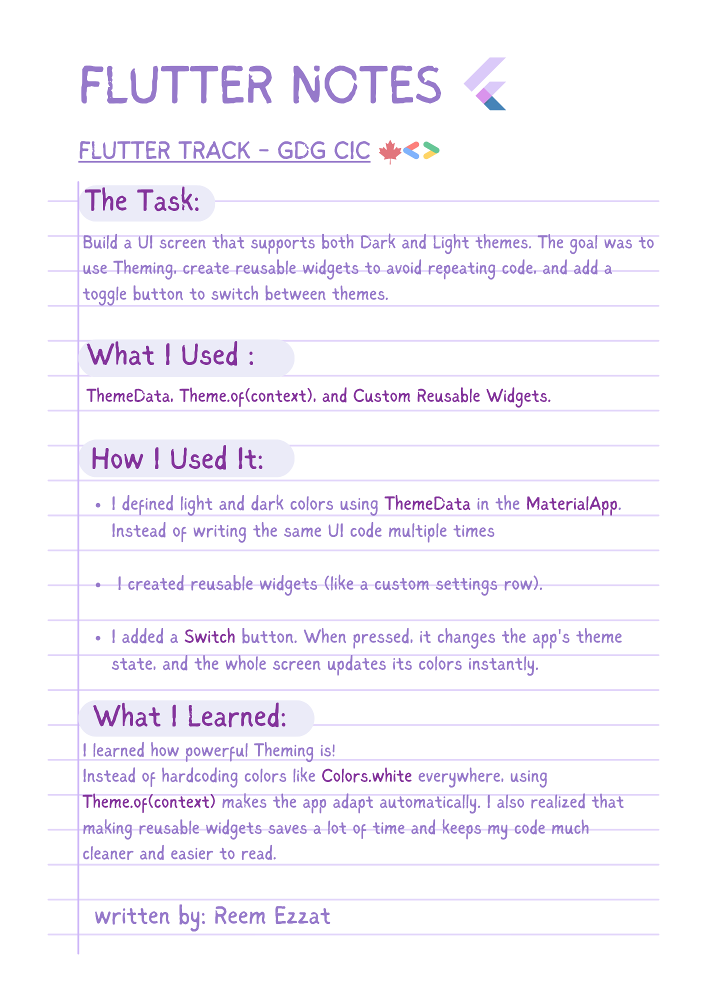
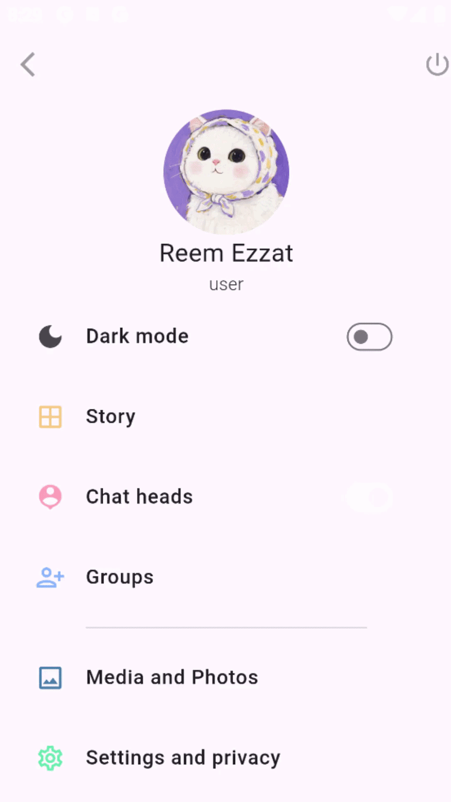

# 🌓🔅Theme-Switcher-Task





## 💻 Example Code

```dart
// Defining dark and light themes in MaterialApp
MaterialApp(
  theme: ThemeData.light(), // Light mode
  darkTheme: ThemeData.dark(), // Dark mode
  themeMode: isDarkMode ? ThemeMode.dark : ThemeMode.light, // Switch logic
  home: const MyScreen(),
);

// Using theme colors in a widget
Container(
  color: Theme.of(context).colorScheme.primary, // Adapts to theme!
  child: const Text('Hello'),
)
````
💡 **Tip:** <br>
Using **Theme.of(context)** is a great habit for theming! It helps your widgets adapt automatically to dark/light mode. If you ever need a specific custom color, you can easily define it inside your **ThemeData** to keep everything organized in one place.


## 🎬 DEMO

